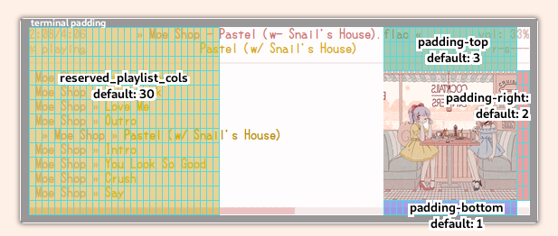

# ncmpcpp-ueberzug


`ncmpcpp-ueberzug` displays ncmpcpp album art using [ueberzug](https://github.com/seebye/ueberzug). It works on `alacritty`, `st`, `urxvt`,  `kitty`, `xterm` and `lxterm`. Unlike existing scripts, it dynamically sizes and positions the cover art such that the window can be any size, even resized. It has many settings to customize the position of the album art to suit your ncmpcpp setup.

## Setup

### Obtaining the files

Install [ueberzug](https://github.com/seebye/ueberzug). If you already have python and pip:

```
$ sudo pip3 install ueberzug
```

Clone the repository into your ncmpcpp config folder and make `ncmpcpp-ueberzug` and `ncmpcpp_cover_art.sh` executable: 
```
$ cd ~/.ncmpcpp
$ git clone https://github.com/alnj/ncmpcpp-ueberzug.git
$ cd ncmpcpp-ueberzug
$ chmod +x ncmpcpp-ueberzug ncmpcpp_cover_art.sh
```

### Configuration
Open your ncmpcpp config at `~/.ncmpcpp/config` and add this line: 
```toml
execute_on_song_change="~/.ncmpcpp/ncmpcpp-ueberzug/ncmpcpp_cover_art.sh"
```

Open `ncmpcpp_cover_art.sh` and adjust the settings at the top of the script to suit to your setup:
| Setting | Description |
| --- | --- |
| `music_library` | Path to your mpd library |
| `fallback_image` | Path to fallback image in case of no cover found |
| `padding_top`, `padding_bottom`, `padding_right` | Padding of the cover image (measured in characters) |
| `max_width` | Cover art will not expand past this limit (measured in characters) |
| `reserved_playlist_cols` | Columns on the left that the cover image is not allowed to encroach on |
| `reserved_cols_in_percent` | If set to `"false"`, `reserved_playlist_cols` will be measured in *characters*, if set to `"true"`, it will be measured in *percent of window width* |
| `force_square="false"` | If set to `"false"`, cover art will be cropped horizontally when encroaching on `reserved_playlist_cols`; if set to `"true"`, it will downsize proportionally |
| `square_alignment="top"` | Specifies the vertical alignment of the cover art if downsized by `force_square`. Can be `"top"`, `"center"` or "`bottom`". |

`reserved_playlist_cols` is the number of columns you want to protect from the cover image such that it will not be covered by it. [The cover image will be truncated so as not to cover that area](img/truncate_reserved_cols.gif).

### Formatting the ncmpcpp songlist



Set padding-top and padding-bottom in accordance with the UI elements you have enabled.

If you use the default [ncmpcpp columns mode](img/ueberzug_columns_mode.gif), make sure that your columns' total width in `~/.ncmpcpp/config` is inferior to 100% and that the last column is song length `{l}`. In this example, the total is `(25)` + `(35)` + `(5)` = 65%.

```toml
playlist_display_mode = "columns"
song_columns_list_format = "(25)[6]{a} (35)[4]{t} (5)[2]{l}"
```

 In `ncmpcpp_cover_art.sh` settings:

```toml
reserved_playlist_cols=75       # Set this at least 5 percentage points above your columns' total
reserved_cols_in_percent="true" # set this to "true"
```

If you use the ncmpcpp classic mode, do not use right-aligned elements, or only right align song length. The default settings in `ncmpcpp_cover_art` should work fine for classic mode, but remember to adjust the top and bottom padding for your setup, and set `padding-right` to at least `4` if you use right-aligned song length.
```toml
# Example playlist formatting with no right-aligned element.
# $/r stops color-reversing at that point for currently-selected item.
# |{%f} falls back to displaying file-name if tags are not found.
song_list_format = "$6{%a »$4 %t$/r$R}|{%f}"

# Alternative with only song length right-aligned
# song_list_format = "$6{%a »$4 %t $R$l}|{%f}"
```

### Running `ncmpcpp-ueberzug`

Simply run `ncmpcpp-ueberzug` to open ncmpcpp with album art enabled.
```
$ ~/.ncmpcpp/ncmpcpp-ueberzug/ncmpcpp-ueberzug
``` 
You may move or symlink it somewhere in your $PATH such that using its full path is unneeded. For example:
```
$ ln -s ~/.ncmpcpp/ncmpcpp-ueberzug/ncmpcpp-ueberzug ~/.local/bin/
$ ncmpcpp-ueberzug
```

## Compatibility

#### Working
* `alacritty`, `st`, `urxvt`,  `kitty`, `xterm`, `lxterm`

#### Require manually setting character size in `ncmpcpp_cover_art.sh`
* `cool-retro-term` 
* `sakura` (resizing can break geometry)
* `gnome-terminal`, `terminator`, `xfce4-terminal`  (Album art displays on the last opened terminal irrespective of which is the ncmpcpp window, resizing can break geometry)

#### Broken
* `konsole` (stops working randomly, geometry is wrong)
* `guake`, `terminology` (geometry is wrong)


## Similar scripts
* [Fixed-width, left-aligned Mopidy album art Python script using Ueberzug](https://www.reddit.com/r/unixporn/comments/addcrf/oc_mopidy_album_art_using_ueberzug/)

* [Ueberzug script that opens the album art in a tmux pane](https://www.reddit.com/r/unixporn/comments/9bifne/ncmpcpp_with_cover_art_ueberzug_tmux_edition/)

* [Fixed-geometry urxvt-compatible script using urxvt background escape codes](https://gist.github.com/vlevit/4588882)

## To-do
* Add support for left-aligned option and tutorial on how to make it useable using ncmpcpp master-slave split.
* Change cleanup mechanism to allow for several ncmpcpp-ueberzug instances
* Support embedded album art
* Support fetching album art from the web
* Support Spotify album art with mopidy
* Update columns gif with new geometry behaviour
